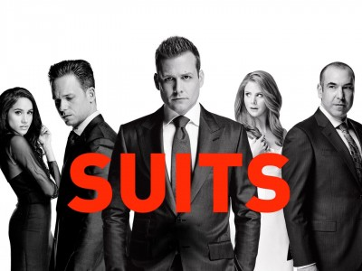

# app-dev
My first repository

#Suits (TV)

#Facts about Suits
1. The 2 main characters are named Harvey Specter (Gabriel Macht) and Mike Ross (Patrick J. Adams)
2. It was directed by Aaron Korsh
3. The show ran from 2011 to 2019
4. The show was set in New York about corporate law firm
5. Mike Ross has a photographic memory that impresses Harvey Specter
6. Harvey Specter was called the best closer in the city
7. The name of the corporate law firm started from Pearson-Hardman to Pearson-Specter to Pearson Specter Litt, ending the show with Specter Litt Wheeler Williams
8. Mike Ross was hired by Harvey Specter to be his Associate
9. Meghan Markle and Sarah Rafferty was also in the show, playing Rachel Zane and Donna Paulsen
10. The show ended with Mike Ross ending up with Rachel Zane, and Harvey Specter with Donna Paulsen

#Suits (TV) Plot

Set in a fictional New York City corporate law firm, the series follows Mike Ross (Patrick J. Adams), a college dropout with a photographic memory, as he works as an associate for the successful and charismatic attorney Harvey Specter (Gabriel Macht). Suits focuses on Harvey and Mike winning lawsuits and closing cases, while at the same time hiding Mike's secret of never having attended law school. It also features Rick Hoffman as Louis Litt, a neurotic, manipulative and unscrupulous financial-law partner; Meghan Markle as the ambitious, talented paralegal Rachel Zane; Sarah Rafferty as Harvey's legal secretary and confidante Donna Paulsen; and Gina Torres as the firm's wise but Machiavellian managing partner, Jessica Pearson. Although the show surrounds itself around legal action in corporate law, it also has a balance with personal lives as well as several love interests throughout the series.
> From Wikipedia
[Suits TV](https://en.wikipedia.org/wiki/Suits_(American_TV_series)#)
